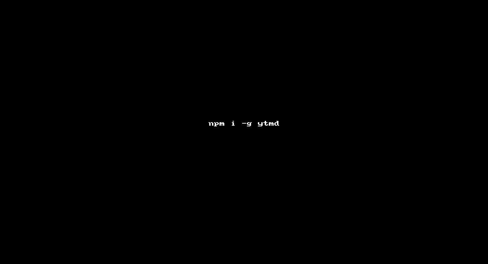

# ytmd

> Make YouTube video URL markdown ready!


## Install

```sh
$ npm install --save ytmd
```


## Usage

```js
var ytmd = require('ytmd');
var url = "https://www.youtube.com/watch?v=jo_B4LTHi3I";
ytmd(url, function(err, md) {
  if(!err) {
    console.log(md);
  }
});
```

## CLI

You can also use it as a CLI app by installing it globally:

```sh
$ npm install --global ytmd
```

```sh
$ ytmd --help

Usage
  $ ytmd <url>

Example
  $ ytmd https://www.youtube.com/watch?v=jo_B4LTHi3I
```

__Sample output:__

```
$ ytmd https://www.youtube.com/watch?v=jo_B4LTHi3I

[](http://www.youtube.com/watch?v=jo_B4LTHi3I)
```

[](http://www.youtube.com/watch?v=jo_B4LTHi3I)


__GIF FTW:__



## License

MIT © [Hemanth.HM](http://h3manth.com)
